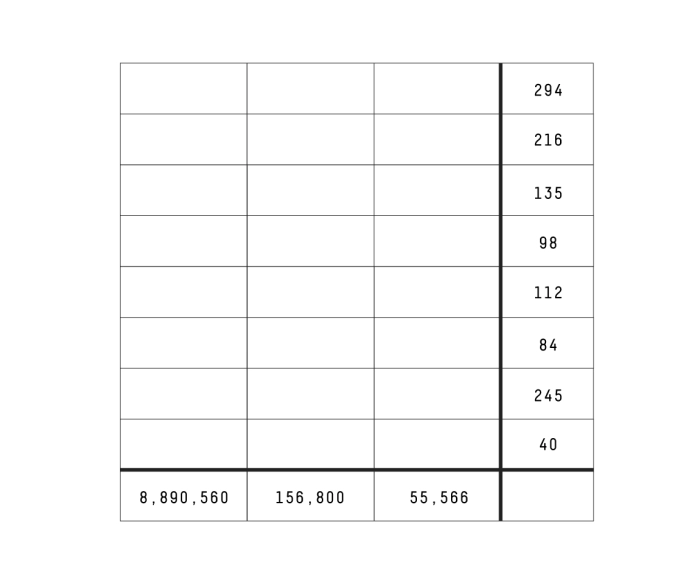
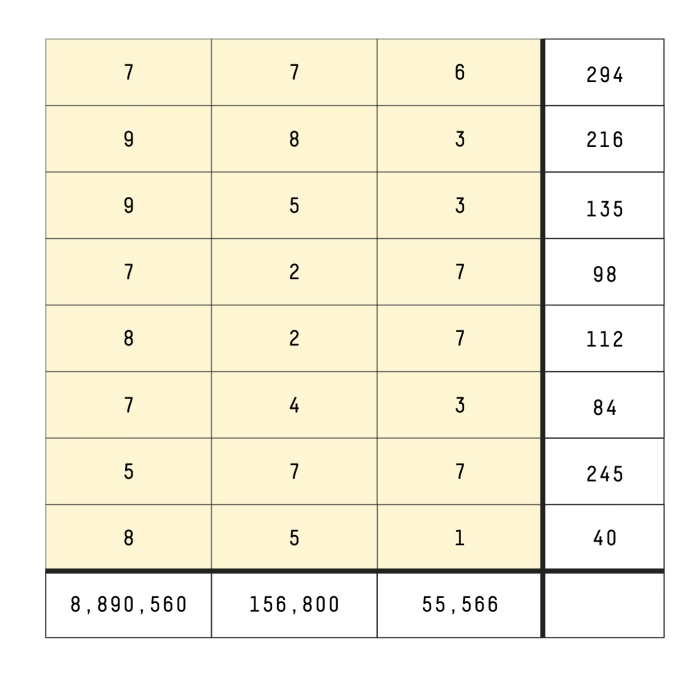

# Solution to last week’s Riddler Classic

Congratulations to 👏 Reuven 👏 of Ottawa, Ontario, Canada, winner of last week’s Riddler Classic.

Last week, the mysterious Barbara Yew offered a mysterious number puzzle, where you had to find eight three-digit numbers. The products of the three digits of each number were shown in the rightmost column of the table below. Meanwhile, the products of the digits in the hundreds, tens and ones places, respectively, were shown in the bottom row.

The products of the three digits in each number are, respectively, 294, 216, 135, 98, 112, 84, 245 and 40. The product of the hundreds digits is 8,890,560. The product of the tens digit is 156,800. The product of the ones digit is 55,566.

First off, I’m delighted to report that this riddle was part of the annual (and this year, virtual!) [MIT Mystery Hunt](https://www.mit.edu/~puzzle/nexthunt.html), puzzles from which have [previously appeared](https://fivethirtyeight.com/features/can-you-stay-awake-for-50-hours-and-solve-150-puzzles/) in this column. The puzzle’s submitter, “Barbara Yew,” was a fictional character within the hunt, which was created and organized by last year’s winning team, the ✈✈✈ Galactic Trendsetters ✈✈✈. Indeed, this week’s winner, Reuven, participated in the hunt as part of team Control Group.

Your first step was to list out the different ways to multiply three digits from 1 to 9 to achieve each row’s product:

    294 was 6×7×7.
    216 was 3×8×9, 4×6×9 or 6×6×6.
    135 was 3×5×9.
    98 was 2×7×7.
    112 was 2×7×8 or 4×4×7.
    84 was 2×6×7 or 3×4×7.
    245 was 5×7×7.
    40 was 1×5×8 or 2×4×5.

For a few solvers, that last row — 40 — was tricky. You had to realize that 1 was an allowable digit, even though it isn’t a prime number.

From here, there were a total of 2,729,376 unique ways to place these digits in the table. That wasn’t a prohibitively large number, and so some solvers, like Siddhartha Srivastava of Patna, India, powered forth with computational brute force to find the unique solution. But this puzzle was indeed solvable with pen (okay, pencil), paper and logic.

Your next step was to find the prime factorization of the products of each column:

    8,890,560 was 2^6×3^4×5^1×7^3.
    156,800 was 2^7×5^2×7^2.
    55,566 was 2^1×3^4×7^3.

Solver Sara McArdle took a closer look at the first column, whose prime factorization implied that four of the eight digits had to be 5, 7, 7 and 7. That meant the remaining factorization, 26×34, or 5,184, had to be the product of the remaining four digits. There was only one way to break down 5,184 in this way: 8, 8, 9 and 9. The two factors of 9 had to come from the second (216) and third (135) rows. Also, because the third column did not have a factor of 5, that meant the three-digit number in the third row had to be 953.

Because all of the first column’s factors of 3 were accounted for, that meant the first row’s 6 couldn’t be in the first column. Also, the second column did not include a factor of 3, which meant the last column had the 6. In other words, the three-digit number in the first row was 776.

That 6 from the first row was responsible for the third column’s single factor of 2. Since the first digit of the second row was 9, the only way that row’s third digit could be odd was for the three-digit number in the second row to be 983.

But what about those two 8s in the first column? At this point, they had to be in the fifth and eighth rows. Because the last column had no factors of 5, the three-digit number in the eighth row had to be 851. And because the third column wasn’t allowed any more factors of 2, the three-digit number in the fifth row had to be 827.

The first column still needs a factor of 5, and the only remaining place it can get it is from the seventh row, whose three-digit number had to be 577. Meanwhile, the first column had all its factors of 2 accounted for, so the three-digit number of the fourth row had to be 727. Last but not least, the three-digit number of the sixth row was 743.

When all was said and done, here was the completed table:

Finally, a big congratulations to the winning team of this year’s incredible MIT Mystery Hunt, Palindrome!