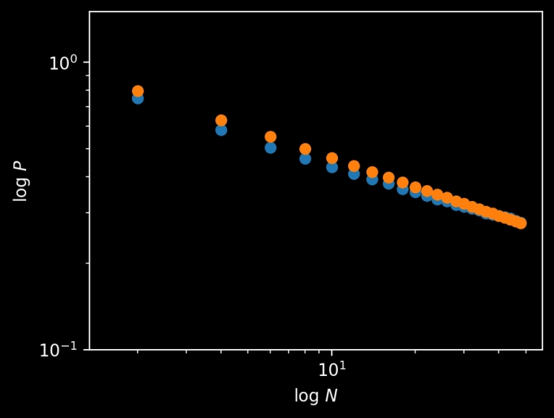

# Solution

Congratulations to 👏 Ali Farhat 👏 of Dearborn, Michigan, winner of last week’s Riddler Classic.

Last week, you were competing in the finals of the Riddler Ski Federation’s winter championship! There was just one opponent left to beat, and then the gold medal would be yours.

Both of you were completing two runs down the mountain, and the times of your runs would be added together. Whoever skied in the least overall time would be the winner. Also, you knew that you and your opponent were evenly matched, and you both had the same normal probability distribution of finishing times for each run. And each skiing run was independent of all the others.

For the first run, your opponent went first. Then, as you crossed the finish line on your own first run, your coach excitedly signaled to you that you were faster than your opponent. Without knowing either exact time, what was the probability that you would still be ahead after the second run and earn your gold medal?

To no one’s surprise, many solvers simulated the skiing championship. Paulina Leperi and Harold Doran both wrote some code that simulated hundreds of thousands of pairs of skiing runs for both you and your opponent, finding that you emerged the winner just about 75 percent of the time. Could the answer have been 75 percent?

A few solvers, like Stergios Athanasoglou and David Ding, tackled the puzzle head on, working through the mathematics (and calculus) of the normal distribution.

But in a cruel (or clever?) twist of mathematics, it turned out that probability distribution of finishing times was irrelevant for this problem. As long as it was the same for both you and your opponent, it didn’t matter if this distribution was normal, uniform or even a Laplace distribution.

As John from Washington, D.C. observed, there was a 50 percent chance that you would be faster than your opponent on the second run, in which case you were guaranteed to be the overall winner. As for the other 50 percent of the time, when your opponent had the faster second run, it all came down to whether the time gap was greater in the first run or the second run — two cases that were equally likely, thanks to the symmetry in the problem. The 25 percent of the time the gap was greater in the first run, you won, while you lost the other 25 percent of the time. Putting it all together, your chance of victory was 50 percent plus 25 percent, or exactly 75 percent.

While it turned out that the normal probability distribution didn’t matter for the puzzle, the same could not be said for the extra credit, where you were asked to repeat the exercise in the case of 30 snowboarders (including you). Again, you were the last to complete the first run, and your coach signaled that you were in the lead at that point. What was the probability that you would win gold in snowboarding?

Even by Riddler standards, this problem was surprisingly hard to calculate. Forget 30 snowboarders with a normal probability distribution — even just three snowboarders with a uniform probability distribution was a challenge, requiring some hefty calculus and order statistics.

Everyone who solved this did so via computation, finding that you had between a 31.4 and 31.5 percent chance of winning the snowboarding championship. Josh Silverman took it one step further, looking at how your chances of winning depended on the number of competitors N. He found that this probability (the lower blue points in the graph below) appeared to be inversely proportional to the cube root of N (modeled by the higher orange points).

Of course, an even more general version of this puzzle was if there were N competitors and R runs in the competition, rather than just two runs. But I’ll save that riddle for our computer overlords to solve.
